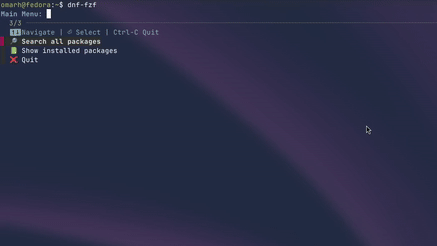

# dnfseek

A TUI (terminal user interface) package browser for Fedora, inspired by [pacseek](https://github.com/moson-mo/pacseek) from Arch Linux.

It uses [fzf](https://github.com/junegunn/fzf) to provide a searchable, interactive interface for browsing, installing, removing, and updating packages via `dnf`.

## ✨ Features
- 🔎 Search all packages or show only installed ones
- ✅ Installed packages are highlighted in green with a checkmark
- 📜 Live preview of `dnf info`
- 📦 Context-aware actions (Install, Reinstall, Remove, Update)
- ↩️ Cancel always takes you back instead of exiting
- Simple Bash script, no heavy dependencies

## 📸 Screenshot




## 🛠️ Requirements
- Fedora (dnf5)
- `fzf`
- `dnf`

Install `fzf`:
```bash
sudo dnf install fzf
```

## 🚀 Usage

Clone the repo:

```bash
git clone https://github.com/YOURNAME/dnfseek.git
cd dnfseek
chmod +x dnfseek.sh
```

Run it:

```bash
./dnfseek.sh
```

(Optional) install globally:

```bash
sudo cp dnfseek.sh /usr/local/bin/dnfseek
```

Then just run:

```bash
dnfseek
```

## 📜 License

MIT (or GPL, your choice)

